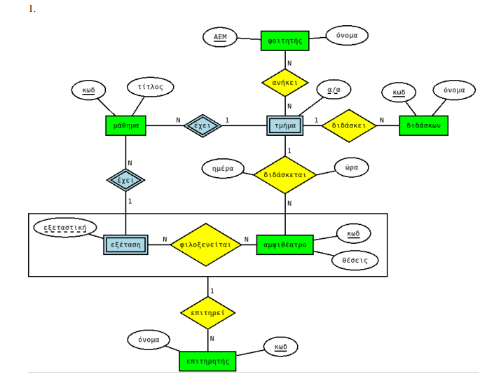
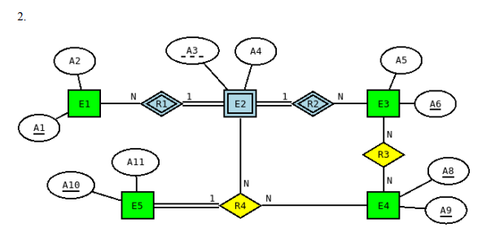

## [Εκφωνήσεις - Homework 1](/Semester2/Databases/Assignments/HW_1)

1. Καλείστε να σχεδιάσετε μία βάση δεδομένων για μια εταιρία τροφοδοσίας (catering). Η βάση σας θα πρέπει να διατηρεί πληροφορίες για τους εργαζόμενους της εταιρίας καθώς και τους πελάτες και τις εκδηλώσεις των οποίων η εταιρία αναλαμβάνει την τροφοδοσία. Συγκεκριμένα:  
   α. Κάθε πελάτης αναγνωρίζεται από το ΑΦΜ του που είναι μοναδικό, και έχει μια επωνυμία, μία
   διεύθυνση και τηλέφωνο.  
   β. Στους εργαζόμενους της εταιρίας συγκαταλέγονται, μάγειρες και σερβιτόροι. Όλοι οι εργαζόμενοι
   καταχωρούνται στο σύστημα με το ΑΜΚΑ τους, και έχουν ακόμα ονοματεπώνυμο, διεύθυνση και
   τηλέφωνο. Οι μάγειρες έχουν μισθό ενώ οι σερβιτόροι πληρώνονται ανάλογα με τις ώρες που έχουν
   δουλέψει κάθε μήνα.  
   γ. Η εταιρία διαθέτει έναν αριθμό από πιάτα τα οποία προσφέρει στους πελάτες. Τα πιάτα διαθέτουν
   ένα περιγραφικό όνομα, ένα είδος (π.χ. κρύο ορεκτικό, χορτοφαγικό, κ.α.) και μία τιμή.  
   δ. Η εταιρία αναλαμβάνει τη τροφοδοσία μιας εκδήλωσης του πελάτη για την οποία θα πρέπει να
   ξέρουμε τα πιάτα που επιλέχθηκαν, το πλήθος των ατόμων που θα περιλαμβάνει η εκδήλωση, τον
   τύπο της εκδήλωσης, τον τόπο και τη ημερομηνία διεξαγωγής της καθώς και μια εκτίμηση διάρκειας.  
   Επίσης για κάθε εκδήλωση καταγράφονται οι σερβιτόροι που θα εργαστούν καθώς και οι μάγειρες
   που συμμετέχουν στην προετοιμασία των πιάτων της εκδήλωσης. Υποθέτουμε ότι για την ίδια
   εκδήλωση μπορούμε να έχουμε πολλούς μάγειρες που ετοιμάζουν διαφορετικό πλήθος από το ίδιο
   πιάτο.

2. Θέλουμε να σχεδιάσουμε μια βάση δεδομένων για την καταγραφή των στοιχείων των περιοδειών που κάνουν καλλιτέχνες..  
   α. Κάθε καλλιτέχνης προσδιορίζεται από έναν κωδικό και έχει ένα όνομα.  
   β. Ένας καλλιτέχνης μπορεί να πραγματοποιήσει πολλές περιοδείες. Κάθε περιοδεία αφορά έναν μόνο
   καλλιτέχνη και μπορεί να έχει τίτλο όπως “Καλοκαίρι 2020 στην Ελλάδα”. Άρα μπορεί πολλοί
   καλλιτέχνες να έχουν περιοδείες με τον ίδιο τίτλο.  
   γ. Κάθε περιοδεία αποτελείται από συναυλίες που γίνονται σε διαφορετικές ημερομηνίες. Σε μια
   ημερομηνία μπορεί να πραγματοποιηθεί μια μόνο συναυλία μιας περιοδείας. Μια συναυλία γίνεται
   σε κάποιον συγκεκριμένο χώρο και προφανώς μπορεί να προγραμματιστούν πολλές συναυλίες μιας
   περιοδείας στον ίδιο χώρο κατά τη διάρκεια μιας περιόδου (εννοείται σε διαφορετικές ημερομηνίες).  
   δ. Για κάθε συναυλία καταγράφονται τα τραγούδια που παίζονται καθώς και η σειρά με την οποία
   παίζονται. Ένα τραγούδι μπορεί να παιχτεί σε πολλές συναυλίες. Ένα τραγούδι έχει έναν μοναδικό
   κωδικό και έναν τίτλο.  
   ε. Υπάρχουν ατζέντηδες που είναι υπεύθυνοι για τις διοργανώσεις των συναυλιών. Μια συναυλία
   διοργανώνεται από έναν μόνο ατζέντη και προσδιορίζεται μια συγκεκριμένη αμοιβή για τον ατζέντη.
   Ένας ατζέντης έχει έναν μοναδικό κωδικό και ένα όνομα.  

3. Θέλουμε να σχεδιάσουμε μια βάση δεδομένων για εξετάσεις που συνταγογραφούν γιατροί σε ασθενείς.  
   α. Υπάρχουν ασθενείς που προσδιορίζονται από το ΑΜΚΑ τους και έχουν και κάποιο όνομα.  
   β. Υπάρχουν γιατροί που έχουν έναν μοναδικό κωδικό και κάποιο όνομα.  
   γ. Οι γιατροί μπορούν να παρακολουθούν πολλούς ασθενείς. Ένας ασθενής μπορεί να παρακολουθείται
   από πολλούς γιατρούς και κατ’ ελάχιστον από έναν γιατρό.  
   δ. Ένας γιατρός μπορεί να συνταγογραφήσει εξετάσεις μόνο στους ασθενείς που παρακολουθεί. Μια
   συγκεκριμένη εξέταση που έχει έναν μοναδικό κωδικό και μια ονομασία μπορεί να συνταγογραφηθεί
   πολλές φορές από έναν γιατρό προς κάποιον ασθενή αλλά σε διαφορετικές ημερομηνίες.

## [Εκφώνηση - Homework 2](/Semester2/Databases/Assignments/HW_2)

Σας δίνονται δυο διαγράμματα ΟΣ. Για το καθένα διάγραμμα να δώσετε το αντίστοιχο σχεσιακό σχήμα.
Για το πρώτο σχεσιακό σχήμα, δώστε επιπλέον και τον SQL κώδικα που το υλοποιεί σε φυσικό σχήμα.
Αποφασίστε για τα κατάλληλα πεδία ορισμού των γνωρισμάτων των πινάκων.

## [Εκφώνηση - Homework 3](/Semester2/Databases/Assignments/HW_3)

Θεωρείστε το παρακάτω σχεσιακό σχήμα “PS Datenbanksysteme WS2014/15, Blatt 4”. Μπορείτε να
το βρείτε στο https://dbis-uibk.github.io/relax/landing ή στο https://relax.mad.uom.gr

Category(<ins>id</ins>, name, season)  
Salesperson(<ins>ssn</ins>, firstname, lastname, type, _boss_)  
Το boss είναι ξένο κλειδί που αναφέρεται στο ssn του Salesperson.  
Specialization(<ins>_ssn , categoryID_</ins>, last_spec_date)  
Το ssn είναι ξένο κλειδί που αναφέρεται στο ssn του Salesperson.  
Το categoryID είναι ξένο κλειδί που αναφέρεται στο id του Category.

Και η μετάφραση του σχήματος:  
Κατηγορία(<ins>κωδικός</ins>, όνομα, εποχή)  
Πωλητής (<ins>ΑΜΚΑ</ins>, όνομα, επώνυμο, τύπος, _προϊστάμενος_)  
Ειδίκευση(<ins>*ΑΜΚΑ, κωδικός_κατηγορίας*</ins>, τελευταία_ημερομηνία)  
Διατυπώστε σε σχεσιακή άλγεβρα τα παρακάτω ερωτήματα. Στις αγκύλες φαίνονται τα γνωρίσματα
που θα πρέπει να εμφανίζει το αποτέλεσμα του ερωτήματος καθώς και το πλήθος των εγγραφών που
είναι στο αποτέλεσμα.

1. Ποιοι πωλητές έχουν ειδίκευση και στη κατηγορία με όνομα ‘tennis’ και στη κατηγορία με
   όνομα ‘golf’; [ssn] [1 row]
2. Ποιοι πωλητές έχουν ειδίκευση είτε στη κατηγορία με όνομα ‘tennis’ είτε στην κατηγορία με
   όνομα ‘ski’; [ssn] [11 rows]
3. Ποιοι είναι οι τύποι των πωλητών με ειδίκευση στην κατηγορία με όνομα ‘snowboard’; [type]
   [3 rows]
4. Ποια είναι τα ονόματα και οι εποχές των κατηγοριών με ειδικεύσεις μόνο με έτος από το 2014
   και μετά; [name, season] [3 rows]
5. Ποιοι πωλητές έχουν ως αφεντικό την ‘Bradley Salinas’; [firstname, lastname] [15 rows]
6. Ποιοι είναι οι πωλητές που δεν έχουν τύπο trainee, και έχουν είτε μικρό όνομα που αρχίζει
   από ‘G’ είτε επώνυμο που αρχίζει από ‘Μ’; [type, firstname, lastname] [5 rows]
7. Ποιοι πωλητές έχουν κοινή ειδίκευση με τον πωλητή με ssn 9771-50397; [ssn, firstname,
   lastname] [5 rows]
8. Ποιοι πωλητές έχουν ειδικέυσεις σε τουλάχιστον τρεις κατηγορίες; [firstname, lastname] [2
   rows]
9. Ποια είναι η ειδίκευση με την αρχαιότερη ημερομηνία; [ssn, categoryID, last_spec_date] [1
   rows]
10. Ποιες είναι οι κατηγορίες για τις οποίες έχουν ειδίκευση όλοι οι τύποι πωλητών; [categoryID]
    [4 rows]

**DISCLAIMER:** Waiting for correct answers
